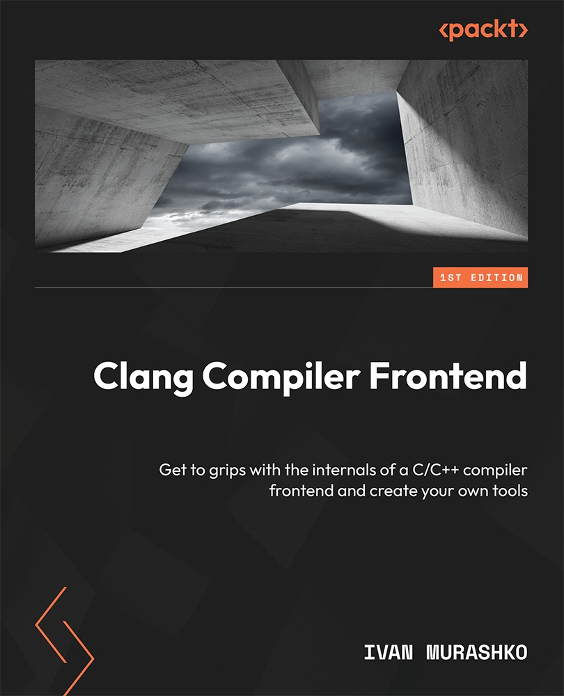

# Clang Compiler Frontend
Get to grips with the internals of a C/C++ compiler frontend and create your own tools  

* 作者：Ivan Murashko
* 译者：陈晓伟
* Packt Publishing Ltd. (首次出版于: March 2024)

> [!IMPORTANT]
> 翻译是译者用自己的思想，换一种语言，对原作者想法的重新阐释。鉴于我的学识所限，误解和错译在所难免。如果你能买到本书的原版，且有能力阅读英文，请直接去读原文。因为与之相较，我的译文可能根本不值得一读。
>
> 
 — 云风，程序员修炼之道第2版译者

## 本书概述

**Low Level Virtual Machine** (**LLVM**), is a collection of modular and reusable compiler and toolchain technologies used to develop compilers and compiler tools, such as linters and refactoring tools. LLVM is written in C++ and can be considered a good example of a well-structured project that uses interesting techniques aimed at making it reusable and efficient. The project can also be considered an excellent example of compiler architecture; diving into it will give you a sense of how compilers are organized and how they function. This should help to understand usage patterns and apply them accordingly.

One of the key components of LLVM is the C/C++ compiler known as Clang. This compiler is widely used across various companies and has been designated as the default compiler for certain development environments, notably for macOS development. Clang will be the primary focus of our investigation in this book, with particular attention to its frontend—the part that is closest to the C/C++ programming language. Specifically, the book will include examples demonstrating how the C++ standard is implemented within the compiler.

A pivotal aspect of LLVM’s design is its modularity, which facilitates the creation of custom tools that exploit the compiler’s comprehensive capabilities. A notable example covered in the book is the Clang-Tidy linter framework, designed to identify undesirable code patterns and recommend corrections. Although it includes several hundred checks, you may not find one specific to your project’s needs. However, the book will provide you with the foundation necessary to develop such a check from the beginning.

LLVM is an actively evolving project with two major releases each year. At the time the book was written, the latest stable release was version 17. Meanwhile, a release candidate for version 18 was introduced in January 2024, with its official release anticipated to coincide with the publication of the book. The book’s content has been verified against the latest compiler version, 18, ensuring it provides insights based on the most current compiler implementation available.

## 作者简介

**Ivan Murashko** is a C++ software engineer. He earned his Ph.D. in Physics from Peter the Great St. Petersburg Polytechnic University and has over 20 years of C++ programming experience, mostly on Linux. Since 2020, he has worked with LLVM compilers and has been an LLVM committer since 2021. His areas of interest include the Clang compiler frontend, Clang Tools (such as Clang-Tidy and Clangd), and performance optimizations for compilers and compiler tools.

## 本书相关

* github翻译地址：https://github.com/xiaoweiChen/Clang-Compiler-Frontend  

* 译文的LaTeX 环境配置：https://www.cnblogs.com/1625--H/p/11524968.html

  * 禁用拼写检查：https://blog.csdn.net/weixin_39278265/article/details/87931348

  * 使用xelatex编译时需要添加`-shell-escape`和`-8bit`选项，例如：

    `xelatex -synctex=1 -interaction=nonstopmode -shell-escape -8bit "C++-Standard-Library".tex`

  * 为了内容中表格和目录索引能正常生成，至少需要连续编译两次

  * Latex中的中文字体([思源宋体](https://github.com/adobe-fonts/source-han-serif/releases))和英文字体([Hack](https://github.com/source-foundry/Hack-windows-installer/releases/tag/v1.6.0))，需要安装后自行配置。如何配置请参考主.tex顶部关于字体的信息。

* vscode中配置LaTeX：https://blog.csdn.net/Ruins_LEE/article/details/123555016

